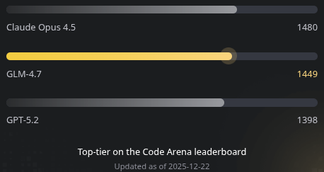

# [Nicks.Guru](https://nicks.guru) Commons Utils


:rocket:


Utility classes.

## Versioning

The version format is inspired by [Scalver](https://scalver.org) and looks like `M.yymmdd.N` (in UTC timezone), where:

* `M`  - major version, same as in [SemVer](https://semver.org): starts from 0, increments in case of backwards
  incompatibility
* `yy` - year minus 2000: 25 for 2025, 100 for 2100
* `mm` - month (zero-padded): 01 = Jan, 02 = Feb, 12 = Dec
* `dd` - day of month (zero-padded): 01 to 31
* `N`  - incremental build number, starts from 0 every day

## Usage

See full version history on
[Maven Central](https://central.sonatype.com/namespace/guru.nicks.commons), use as follows:

```xml
<dependencyManagement>
    <dependencies>
        <dependency>
            <groupId>guru.nicks.commons</groupId>
            <artifactId>bom</artifactId>
            <version>100.260212.0</version>
            <type>pom</type>
            <scope>import</scope>
        </dependency>
    </dependencies>
</dependencyManagement>

<dependencies>
    <dependency>
        <groupId>guru.nicks.commons</groupId>
        <artifactId>utils</artifactId>
    </dependency>
</dependencies>
```

## Documentation

To browse the API documentation, click [here](https://nicks.guru/commons/commons-utils/apidocs).

This software adheres to the BDD (Behavior-Driven Development) approach. See module usage examples in Cucumber
test [scenarios](src/test/resources/cucumber/) and [steps](src/test/java/guru/nicks/cucumber/).

## AI Tip

Grab a 10% discount on **GLM 4.7 Coding Plan** model.

🚀 Full support for 10+ top coding tools such as Claude Code, Cursor, Cline, Kilo Code, Roo Code, Sweep AI - starting at
just $3 per month. **[Subscribe now](https://z.ai/subscribe?ic=FQFBJRY7RM)** and take advantage of the limited-time
offer.



## Disclaimer

THIS CODE IS PROVIDED "AS IS" WITHOUT WARRANTY OF ANY KIND, EITHER EXPRESSED OR IMPLIED, INCLUDING BUT NOT LIMITED
TO THE IMPLIED WARRANTIES OF MERCHANTABILITY AND FITNESS FOR A PARTICULAR PURPOSE. USE AT YOUR OWN RISK.

Copyright © 2025-2026 [nicks.guru](https://nicks.guru). All rights reserved.
